# 🏗️ WaveMusic API Architecture

## System Overview

WaveMusic is a sophisticated multi-source music streaming API that aggregates content from multiple providers and provides a unified interface for music discovery and playback.

## Architecture Diagram

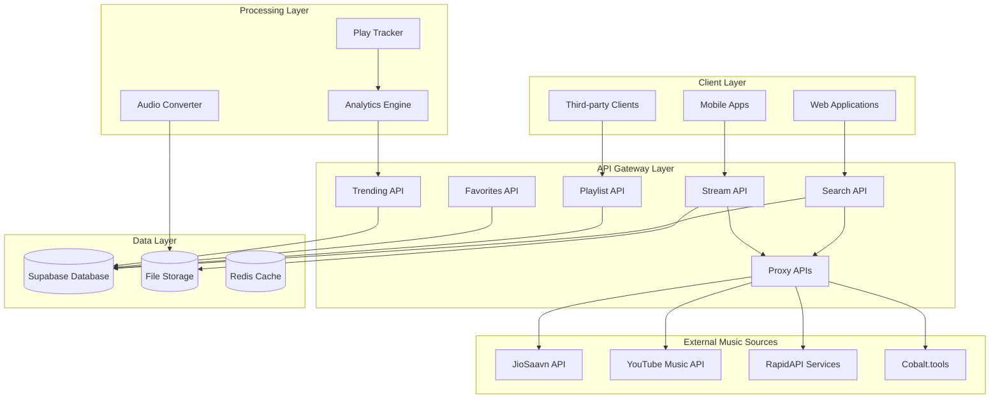

## Data Flow Architecture

### Search Flow

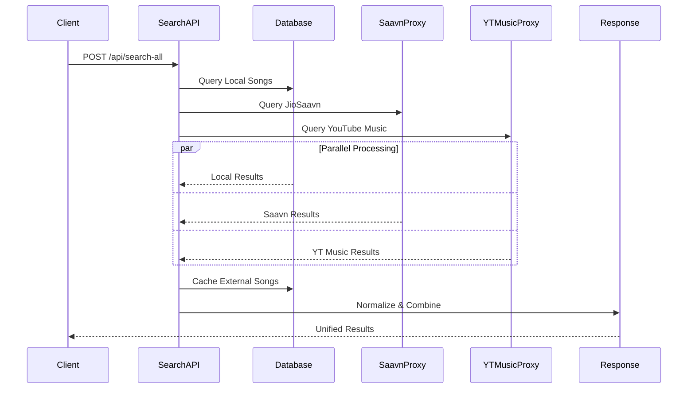

### Streaming Flow

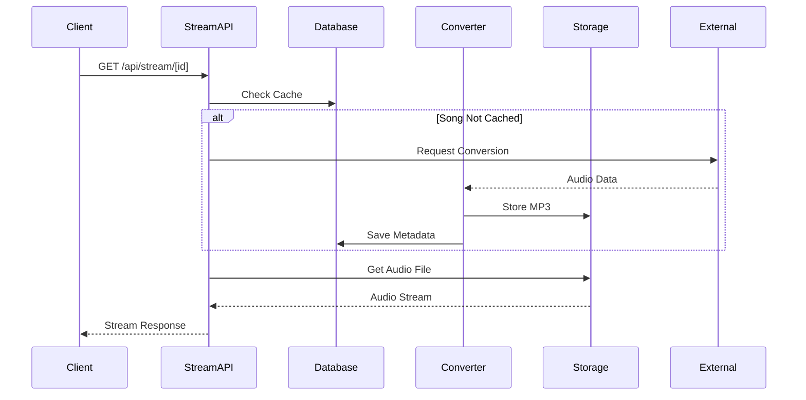

## API Layer Architecture

### Core APIs

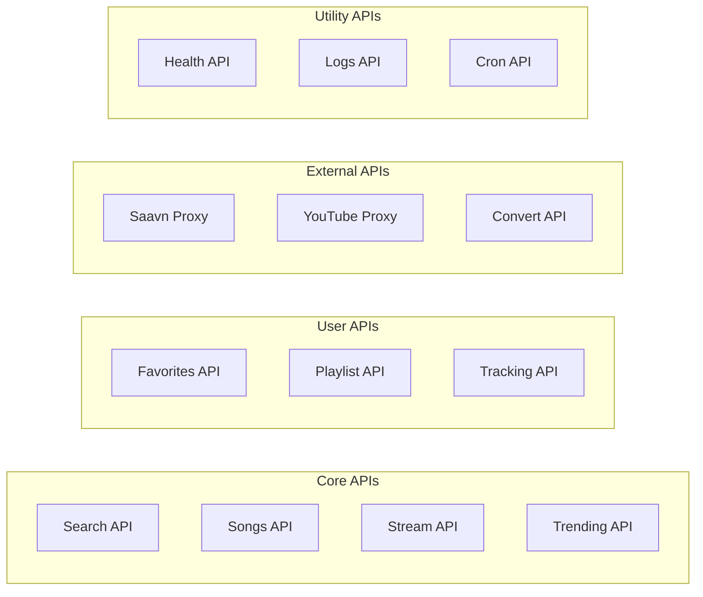

## Database Schema

### Core Tables

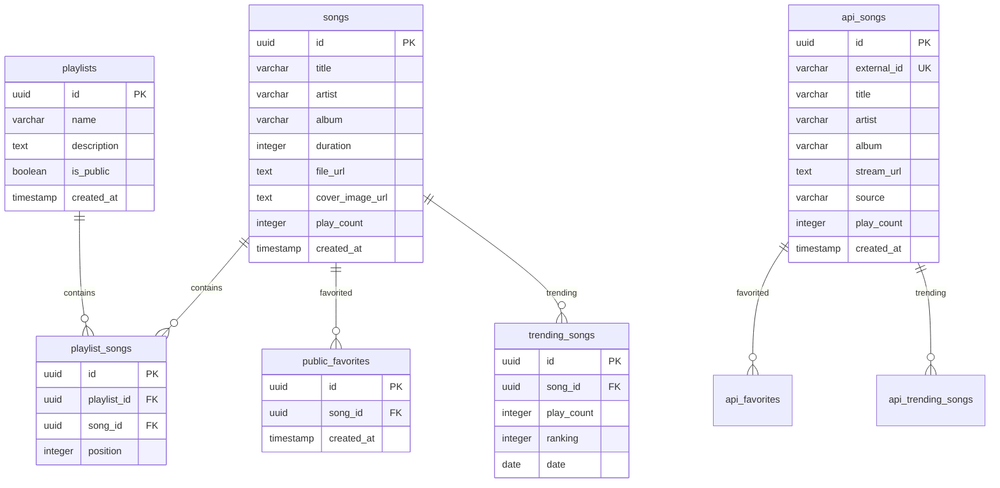

## External Integration Architecture

### JioSaavn Integration

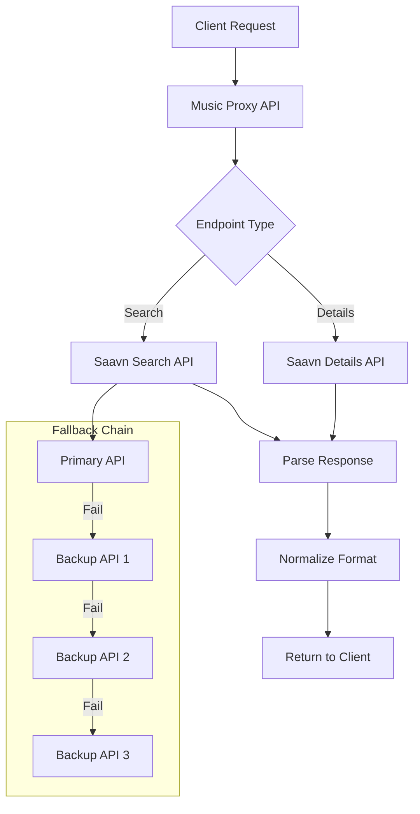

### YouTube Music Integration

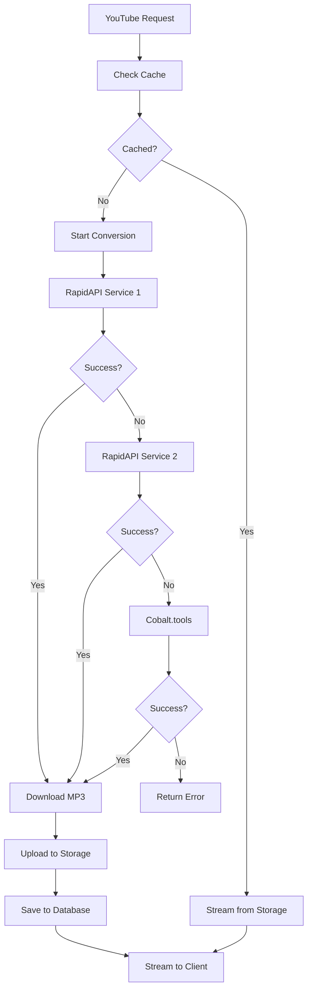

## Performance Architecture

### Caching Strategy

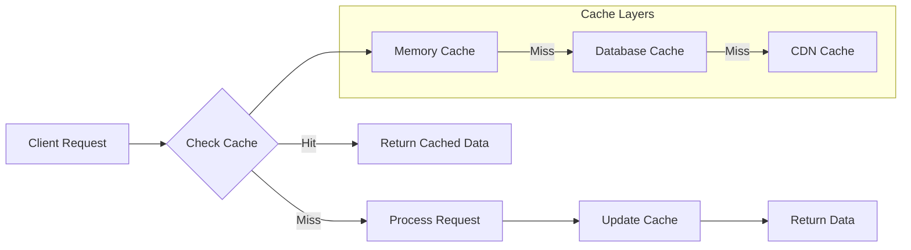

### Rate Limiting

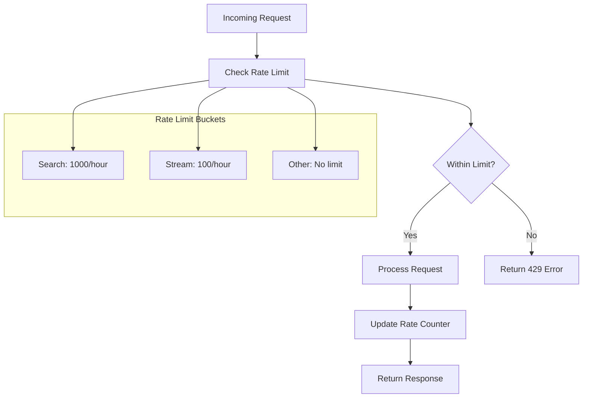

## Security Architecture

### API Security

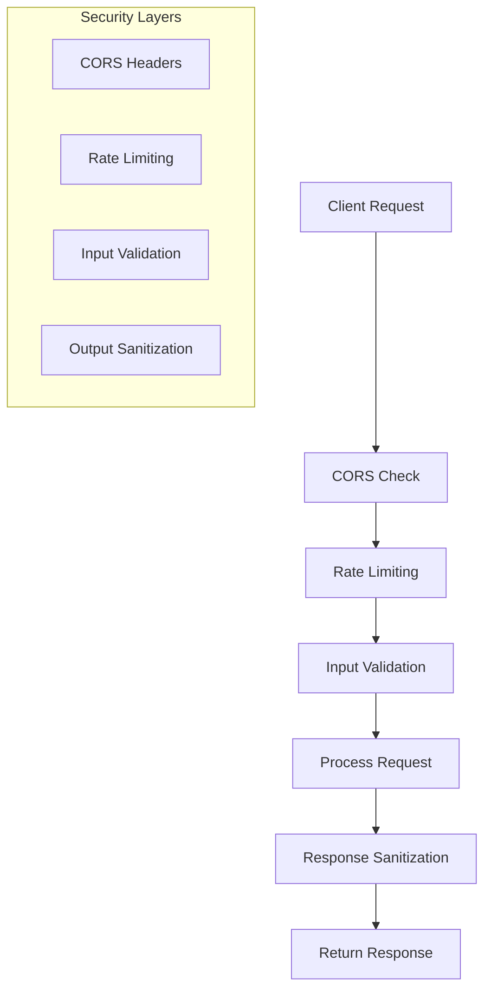

## Monitoring & Analytics

### Analytics Pipeline

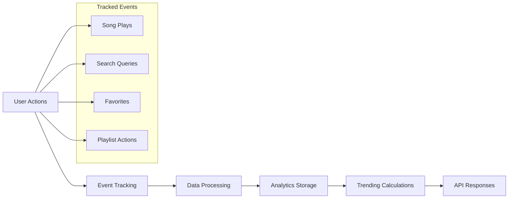

## Deployment Architecture

### Production Setup

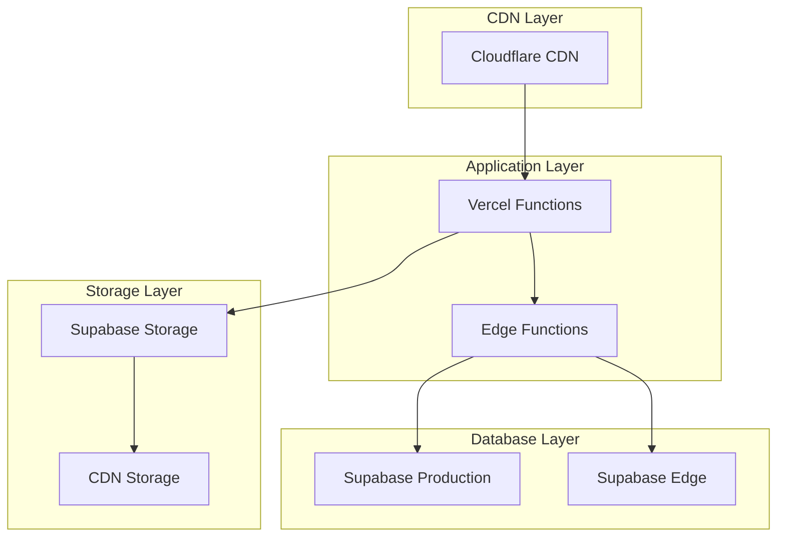

## Error Handling Architecture

### Error Flow

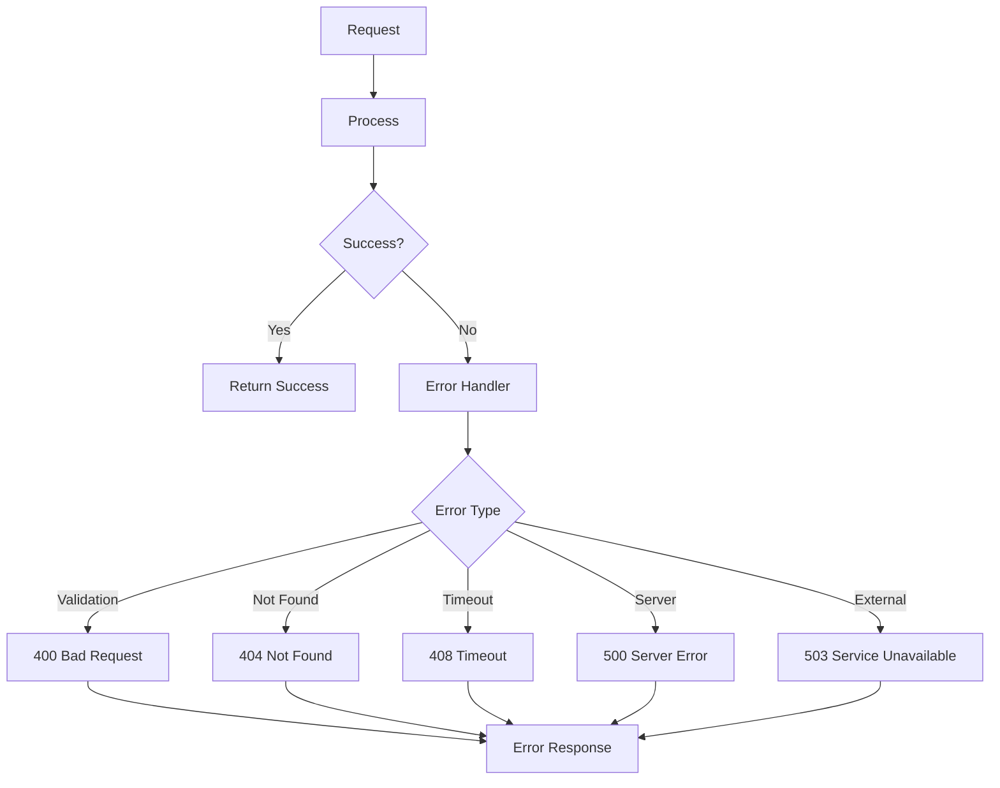

## Scalability Considerations

### Horizontal Scaling

- **API Functions**: Auto-scaling Vercel functions
- **Database**: Supabase auto-scaling
- **Storage**: CDN distribution
- **Caching**: Redis cluster (future)

### Performance Optimization

- **Parallel Processing**: Concurrent API calls
- **Caching**: Multi-layer caching strategy
- **CDN**: Global content distribution
- **Database Indexing**: Optimized queries

---

This architecture ensures high availability, scalability, and performance while maintaining simplicity for developers using the API.
