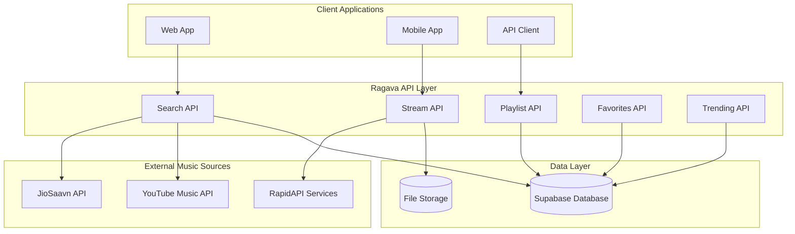
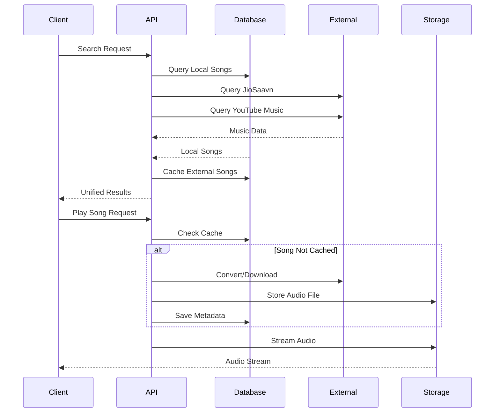
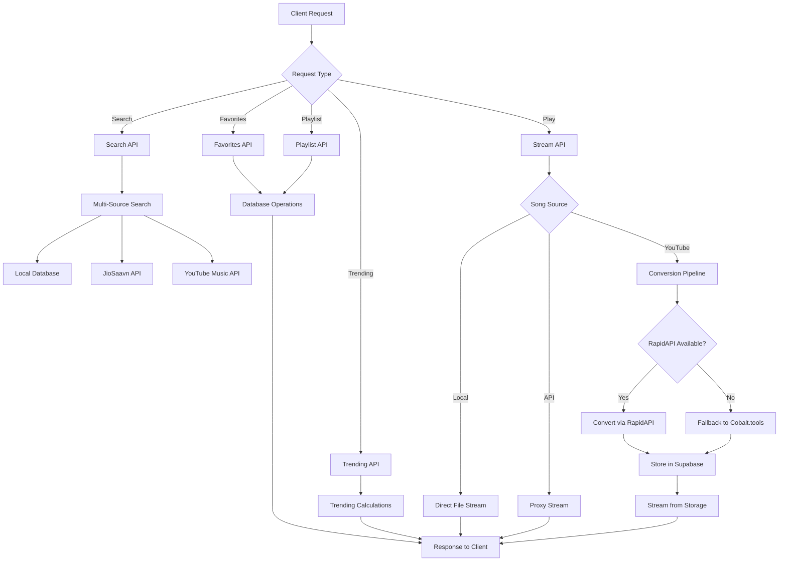
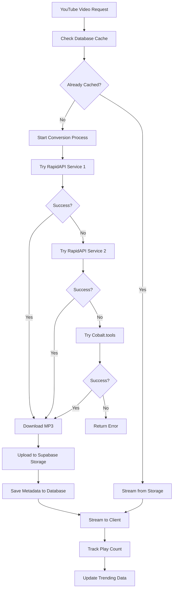
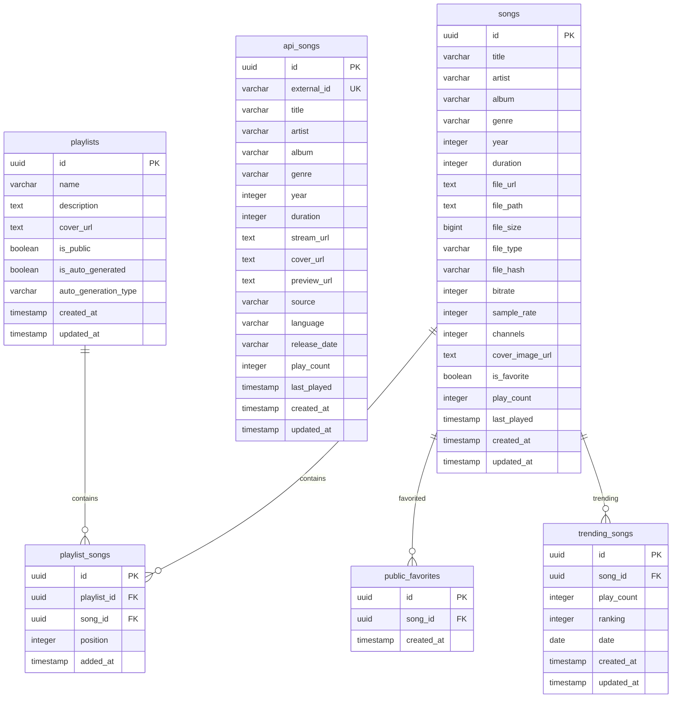

# 🎵 Ragava API Documentation

## Table of Contents

1. [Overview](#overview)
2. [Architecture](#architecture)
3. [Authentication](#authentication)
4. [Core APIs](#core-apis)
5. [External Music Sources](#external-music-sources)
6. [User Data APIs](#user-data-apis)
7. [Utility APIs](#utility-apis)
8. [Data Models](#data-models)
9. [Error Handling](#error-handling)
10. [Rate Limits](#rate-limits)
11. [Examples](#examples)
12. [SDK/Client Libraries](#sdkclient-libraries)

---

## Overview

Ragava is a comprehensive multi-source music streaming API that provides access to:

- **Local Music Library**: User-uploaded music files
- **JioSaavn Integration**: Indian and international music
- **YouTube Music Integration**: Global music library
- **Playlist Management**: Create and manage playlists
- **Favorites System**: Save favorite songs
- **Trending Analytics**: Real-time trending calculations

### Base URL

```
Production: https://ragava.vercel.app/api
Development: http://localhost:3000/api
```

---

## Architecture

### System Architecture Diagram



### Data Flow Architecture



### API Request Flow Diagram



### YouTube Music Conversion Flow



---

## Authentication

**No Authentication Required** - Ragava operates as a public music streaming service.

All endpoints are publicly accessible without API keys or authentication tokens.

---

## API Endpoint Reference

### Complete Endpoint List

| Method   | Endpoint                       | Description                      | Parameters                                        |
| -------- | ------------------------------ | -------------------------------- | ------------------------------------------------- |
| `POST`   | `/api/search-all`              | Master search across all sources | `query`, `limit`, `source`                        |
| `GET`    | `/api/songs`                   | Get all local songs              | -                                                 |
| `GET`    | `/api/stream/[id]`             | Stream local audio file          | `id` (song UUID)                                  |
| `GET`    | `/api/trending`                | Get trending songs               | `limit`, `date`, `source`                         |
| `POST`   | `/api/trending`                | Update trending calculations     | `date`                                            |
| `GET`    | `/api/music-proxy`             | JioSaavn API proxy               | `endpoint`, `query`, `songId`, `limit`            |
| `GET`    | `/api/ytmusic-proxy`           | YouTube Music API proxy          | `action`, `query`, `videoId`, `limit`             |
| `POST`   | `/api/youtube-stream`          | Create YouTube stream            | `videoId`, `title`, `artist`, `album`, `duration` |
| `GET`    | `/api/youtube-proxy/[videoId]` | Stream YouTube audio             | `videoId`                                         |
| `POST`   | `/api/youtube-download`        | Download YouTube video           | `video_id`, `title`, `artist`                     |
| `POST`   | `/api/youtube-convert`         | Convert YouTube video            | `videoId`, `title`, `artist`                      |
| `GET`    | `/api/favorites`               | Get all favorites                | -                                                 |
| `POST`   | `/api/favorites/[id]`          | Add to favorites                 | `id` (song UUID)                                  |
| `DELETE` | `/api/favorites/[id]`          | Remove from favorites            | `id` (song UUID)                                  |
| `GET`    | `/api/playlists`               | Get all playlists                | -                                                 |
| `POST`   | `/api/playlists`               | Create playlist                  | `name`, `description`, `is_public`                |
| `GET`    | `/api/playlists/[id]`          | Get playlist                     | `id`, `includeSongs`                              |
| `PUT`    | `/api/playlists/[id]`          | Update playlist                  | `id`, `name`, `description`, `is_public`          |
| `DELETE` | `/api/playlists/[id]`          | Delete playlist                  | `id`                                              |
| `POST`   | `/api/playlists/[id]/songs`    | Add song to playlist             | `id`, `songId`                                    |
| `DELETE` | `/api/playlists/[id]/songs`    | Remove song from playlist        | `id`, `songId`                                    |
| `POST`   | `/api/track-play`              | Track local song play            | `songId`, `playDuration`                          |
| `POST`   | `/api/api-track-play`          | Track API song play              | `songId`, `playDuration`                          |
| `GET`    | `/api/health`                  | Health check                     | -                                                 |
| `GET`    | `/api/logs`                    | Get application logs             | -                                                 |
| `DELETE` | `/api/logs`                    | Clear application logs           | -                                                 |

---

## Core APIs

### 1. Search API

#### `POST /api/search-all`

**Description**: Master search endpoint that searches across all music sources simultaneously.

**Request Body**:

```json
{
  "query": "string",
  "limit": 1000,
  "source": "all" // "all", "local", "api", "saavn", "ytmusic"
}
```

**Response**:

```json
{
  "success": true,
  "query": "search term",
  "sources": {
    "local": {
      "songs": [...],
      "total": 25
    },
    "api": {
      "songs": [...],
      "total": 150
    },
    "saavn": {
      "songs": [...],
      "total": 200
    },
    "ytmusic": {
      "songs": [...],
      "total": 300,
      "error": null
    }
  },
  "totalResults": 675,
  "timestamp": "2024-01-20T10:30:00Z"
}
```

**Example**:

```bash
curl -X POST https://ragava.vercel.app/api/search-all \
  -H "Content-Type: application/json" \
  -d '{"query": "bollywood hits", "limit": 50}'
```

### 2. Songs API

#### `GET /api/songs`

**Description**: Get all local songs from the database.

**Response**:

```json
[
  {
    "id": "uuid",
    "title": "Song Title",
    "artist": "Artist Name",
    "album": "Album Name",
    "duration": 240,
    "file_url": "https://...",
    "cover_image_url": "https://...",
    "play_count": 15,
    "created_at": "2024-01-20T10:30:00Z"
  }
]
```

#### `GET /api/stream/[id]`

**Description**: Stream audio files with range support for local songs.

**Headers**:

```
Range: bytes=0-1023
```

**Response**: Audio file stream with proper headers for range requests.

### 3. Trending API

#### `GET /api/trending`

**Description**: Get trending songs with Spotify-like algorithm.

**Query Parameters**:

- `limit`: Number of results (default: 1000)
- `date`: Date for trending calculation (default: today)
- `source`: Filter by source ("all", "local", "api", "ytmusic", "saavn")

**Response**:

```json
{
  "songs": [
    {
      "id": "uuid",
      "title": "Trending Song",
      "artist": "Artist",
      "trending_play_count": 150,
      "trending_ranking": 1,
      "source": "ytmusic"
    }
  ],
  "date": "2024-01-20",
  "total": 50,
  "sources": {
    "local": 10,
    "api": 15,
    "ytmusic": 20,
    "saavn": 5
  }
}
```

---

## External Music Sources

### 1. JioSaavn Integration

#### `GET /api/music-proxy`

**Description**: Proxy for JioSaavn API calls.

**Query Parameters**:

- `endpoint`: Saavn API endpoint
- `query`: Search query
- `songId`: Song ID for details
- `limit`: Result limit

**Example**:

```bash
curl "https://ragava.vercel.app/api/music-proxy?endpoint=https://saavn.dev/api/search/songs&query=bollywood&limit=50"
```

### 2. YouTube Music Integration

#### `GET /api/ytmusic-proxy`

**Description**: YouTube Music API proxy with multiple actions.

**Query Parameters**:

- `action`: "search", "details", "trending", "suggestions", "health"
- `query`: Search query
- `videoId`: YouTube video ID
- `limit`: Result limit

**Actions**:

**Search**:

```bash
curl "https://ragava.vercel.app/api/ytmusic-proxy?action=search&query=trending music&limit=100"
```

**Details**:

```bash
curl "https://ragava.vercel.app/api/ytmusic-proxy?action=details&videoId=dQw4w9WgXcQ"
```

**Trending**:

```bash
curl "https://ragava.vercel.app/api/ytmusic-proxy?action=trending&limit=50"
```

#### `POST /api/youtube-stream`

**Description**: Create YouTube Music proxy streams.

**Request Body**:

```json
{
  "videoId": "dQw4w9WgXcQ",
  "title": "Song Title",
  "artist": "Artist Name",
  "album": "Album Name",
  "duration": 240,
  "thumbnailUrl": "https://..."
}
```

**Response**:

```json
{
  "success": true,
  "songId": "uuid",
  "streamUrl": "https://ragava.vercel.app/api/youtube-proxy/dQw4w9WgXcQ",
  "cached": false
}
```

#### `GET /api/youtube-proxy/[videoId]`

**Description**: Stream YouTube audio with complex conversion system.

**Features**:

- Multiple conversion services (RapidAPI, Cobalt.tools)
- Automatic caching in Supabase Storage
- Fallback mechanisms
- Range request support

---

## User Data APIs

### 1. Favorites System

#### `GET /api/favorites`

**Description**: Get all user favorites.

**Response**:

```json
[
  {
    "id": "uuid",
    "song_id": "uuid",
    "created_at": "2024-01-20T10:30:00Z"
  }
]
```

#### `POST /api/favorites/[id]`

**Description**: Add song to favorites.

**Response**:

```json
{
  "favorite": {
    "id": "uuid",
    "song_id": "uuid",
    "created_at": "2024-01-20T10:30:00Z"
  }
}
```

#### `DELETE /api/favorites/[id]`

**Description**: Remove song from favorites.

**Response**:

```json
{
  "success": true
}
```

### 2. Playlist Management

#### `GET /api/playlists`

**Description**: Get all playlists.

**Response**:

```json
[
  {
    "id": "uuid",
    "name": "My Playlist",
    "description": "Description",
    "is_public": true,
    "created_at": "2024-01-20T10:30:00Z"
  }
]
```

#### `GET /api/playlists/[id]`

**Description**: Get specific playlist with optional songs.

**Query Parameters**:

- `includeSongs`: Include songs in response (true/false)

**Response**:

```json
{
  "playlist": {
    "id": "uuid",
    "name": "My Playlist",
    "playlist_songs": [
      {
        "position": 0,
        "songs": {
          "id": "uuid",
          "title": "Song Title",
          "artist": "Artist"
        }
      }
    ]
  }
}
```

#### `POST /api/playlists`

**Description**: Create new playlist.

**Request Body**:

```json
{
  "name": "New Playlist",
  "description": "Description",
  "is_public": true
}
```

#### `PUT /api/playlists/[id]`

**Description**: Update playlist.

**Request Body**:

```json
{
  "name": "Updated Name",
  "description": "Updated Description",
  "is_public": false
}
```

#### `DELETE /api/playlists/[id]`

**Description**: Delete playlist.

**Response**:

```json
{
  "success": true
}
```

#### `POST /api/playlists/[id]/songs`

**Description**: Add song to playlist.

**Request Body**:

```json
{
  "songId": "uuid"
}
```

#### `DELETE /api/playlists/[id]/songs`

**Description**: Remove song from playlist.

**Query Parameters**:

- `songId`: Song ID to remove

---

## Utility APIs

### 1. Health & Monitoring

#### `GET /api/health`

**Description**: Basic health check.

**Response**:

```json
{
  "status": "ok",
  "message": "Wave Music Player API is running",
  "timestamp": "2024-01-20T10:30:00Z"
}
```

#### `GET /api/logs`

**Description**: Fetch application logs.

**Response**:

```json
{
  "logs": [
    {
      "timestamp": "2024-01-20T10:30:00Z",
      "level": "INFO",
      "message": "Search completed successfully"
    }
  ]
}
```

#### `DELETE /api/logs`

**Description**: Clear application logs.

**Response**:

```json
{
  "message": "Logs cleared successfully"
}
```

### 2. Play Tracking

#### `POST /api/track-play`

**Description**: Track local song plays.

**Request Body**:

```json
{
  "songId": "uuid",
  "playDuration": 240
}
```

#### `POST /api/api-track-play`

**Description**: Track API song plays.

**Request Body**:

```json
{
  "songId": "uuid",
  "playDuration": 240
}
```

---

## Data Models

### StreamableSong

```typescript
interface StreamableSong {
  id: string; // Unique identifier
  title: string; // Song title
  artist: string; // Artist name
  album?: string; // Album name
  duration: number; // Duration in seconds
  cover_url: string; // Cover image URL
  stream_url: string; // Audio stream URL
  source: 'api' | 'local' | 'ytmusic' | 'saavn';
  preview_url?: string; // Preview URL (if available)
  release_date?: string; // Release date
  genre?: string; // Genre
  language?: string; // Language
  videoId?: string; // YouTube video ID (for ytmusic)
}
```

### Database Schema



---

## Error Handling

### Error Response Format

```json
{
  "success": false,
  "error": "Error message",
  "details": "Additional error details",
  "timestamp": "2024-01-20T10:30:00Z"
}
```

### Common HTTP Status Codes

- `200` - Success
- `201` - Created
- `400` - Bad Request
- `404` - Not Found
- `408` - Request Timeout
- `409` - Conflict
- `500` - Internal Server Error
- `503` - Service Unavailable

### Error Examples

**Missing Parameters**:

```json
{
  "success": false,
  "error": "Missing query parameter",
  "details": "The 'query' parameter is required for search operations"
}
```

**External API Failure**:

```json
{
  "success": false,
  "error": "YouTube Music search failed",
  "details": "External API is currently unavailable",
  "sources": {
    "ytmusic": {
      "songs": [],
      "total": 0,
      "error": "Service temporarily unavailable"
    }
  }
}
```

---

## Rate Limits

### Current Limits

- **Search API**: 1000 requests per hour per IP
- **Stream API**: 100 requests per hour per IP
- **External APIs**: Limited by external service providers

### Rate Limit Headers

```
X-RateLimit-Limit: 1000
X-RateLimit-Remaining: 999
X-RateLimit-Reset: 1642680000
```

---

## Examples

### Complete Search and Play Flow

```javascript
// 1. Search for music
const searchResponse = await fetch('https://ragava.vercel.app/api/search-all', {
  method: 'POST',
  headers: { 'Content-Type': 'application/json' },
  body: JSON.stringify({
    query: 'bollywood hits',
    limit: 50,
  }),
});

const searchData = await searchResponse.json();
console.log(`Found ${searchData.totalResults} songs`);

// 2. Get a song from results
const song = searchData.sources.ytmusic.songs[0];

// 3. Add to favorites
await fetch(`https://ragava.vercel.app/api/favorites/${song.id}`, {
  method: 'POST',
});

// 4. Create playlist
const playlistResponse = await fetch(
  'https://ragava.vercel.app/api/playlists',
  {
    method: 'POST',
    headers: { 'Content-Type': 'application/json' },
    body: JSON.stringify({
      name: 'My Bollywood Playlist',
      description: 'Favorite Bollywood songs',
    }),
  }
);

const playlist = await playlistResponse.json();

// 5. Add song to playlist
await fetch(`https://ragava.vercel.app/api/playlists/${playlist.id}/songs`, {
  method: 'POST',
  headers: { 'Content-Type': 'application/json' },
  body: JSON.stringify({ songId: song.id }),
});

// 6. Track play
await fetch('https://ragava.vercel.app/api/api-track-play', {
  method: 'POST',
  headers: { 'Content-Type': 'application/json' },
  body: JSON.stringify({
    songId: song.id,
    playDuration: 240,
  }),
});
```

### Python Example

```python
import requests
import json

# Search for music
search_data = {
    "query": "trending music 2024",
    "limit": 100
}

response = requests.post(
    'https://ragava.vercel.app/api/search-all',
    json=search_data
)

data = response.json()

if data['success']:
    print(f"Found {data['totalResults']} songs")

    # Get trending songs
    for source, source_data in data['sources'].items():
        print(f"{source}: {source_data['total']} songs")

        for song in source_data['songs'][:5]:  # Show first 5
            print(f"  - {song['title']} by {song['artist']}")
```

### React Hook Example

```javascript
import { useState, useEffect } from 'react';

function useRagavaAPI() {
  const [songs, setSongs] = useState([]);
  const [loading, setLoading] = useState(false);
  const [error, setError] = useState(null);

  const searchSongs = async (query, limit = 100) => {
    setLoading(true);
    setError(null);

    try {
      const response = await fetch('/api/search-all', {
        method: 'POST',
        headers: { 'Content-Type': 'application/json' },
        body: JSON.stringify({ query, limit }),
      });

      const data = await response.json();

      if (data.success) {
        const allSongs = [
          ...data.sources.local.songs,
          ...data.sources.api.songs,
          ...data.sources.saavn.songs,
          ...data.sources.ytmusic.songs,
        ];
        setSongs(allSongs);
      } else {
        setError(data.error);
      }
    } catch (err) {
      setError(err.message);
    } finally {
      setLoading(false);
    }
  };

  const addToFavorites = async songId => {
    try {
      await fetch(`/api/favorites/${songId}`, {
        method: 'POST',
      });
    } catch (err) {
      console.error('Failed to add to favorites:', err);
    }
  };

  return { songs, loading, error, searchSongs, addToFavorites };
}

// Usage in component
function MusicSearch() {
  const { songs, loading, error, searchSongs, addToFavorites } = useRagavaAPI();
  const [query, setQuery] = useState('');

  const handleSearch = () => {
    if (query.trim()) {
      searchSongs(query);
    }
  };

  return (
    <div>
      <input
        value={query}
        onChange={e => setQuery(e.target.value)}
        placeholder='Search for music...'
      />
      <button onClick={handleSearch}>Search</button>

      {loading && <p>Searching...</p>}
      {error && <p>Error: {error}</p>}

      <div>
        {songs.map(song => (
          <div key={song.id}>
            <h3>{song.title}</h3>
            <p>{song.artist}</p>
            <button onClick={() => addToFavorites(song.id)}>
              Add to Favorites
            </button>
          </div>
        ))}
      </div>
    </div>
  );
}
```

---

## SDK/Client Libraries

### JavaScript/TypeScript SDK

```typescript
class RagavaAPI {
  private baseUrl: string;

  constructor(baseUrl = 'https://ragava.vercel.app/api') {
    this.baseUrl = baseUrl;
  }

  async search(
    query: string,
    options: SearchOptions = {}
  ): Promise<SearchResult> {
    const response = await fetch(`${this.baseUrl}/search-all`, {
      method: 'POST',
      headers: { 'Content-Type': 'application/json' },
      body: JSON.stringify({
        query,
        limit: options.limit || 1000,
        source: options.source || 'all',
      }),
    });

    return response.json();
  }

  async getTrending(options: TrendingOptions = {}): Promise<TrendingResult> {
    const params = new URLSearchParams();
    if (options.limit) params.set('limit', options.limit.toString());
    if (options.date) params.set('date', options.date);
    if (options.source) params.set('source', options.source);

    const response = await fetch(`${this.baseUrl}/trending?${params}`);
    return response.json();
  }

  async addToFavorites(songId: string): Promise<void> {
    await fetch(`${this.baseUrl}/favorites/${songId}`, {
      method: 'POST',
    });
  }

  async removeFromFavorites(songId: string): Promise<void> {
    await fetch(`${this.baseUrl}/favorites/${songId}`, {
      method: 'DELETE',
    });
  }

  async createPlaylist(name: string, description?: string): Promise<Playlist> {
    const response = await fetch(`${this.baseUrl}/playlists`, {
      method: 'POST',
      headers: { 'Content-Type': 'application/json' },
      body: JSON.stringify({ name, description, is_public: true }),
    });

    return response.json();
  }

  async addToPlaylist(playlistId: string, songId: string): Promise<void> {
    await fetch(`${this.baseUrl}/playlists/${playlistId}/songs`, {
      method: 'POST',
      headers: { 'Content-Type': 'application/json' },
      body: JSON.stringify({ songId }),
    });
  }

  async trackPlay(songId: string, duration: number = 0): Promise<void> {
    const endpoint =
      songId.startsWith('api_') || songId.includes('ytmusic_')
        ? 'api-track-play'
        : 'track-play';

    await fetch(`${this.baseUrl}/${endpoint}`, {
      method: 'POST',
      headers: { 'Content-Type': 'application/json' },
      body: JSON.stringify({ songId, playDuration: duration }),
    });
  }
}

// Usage
const api = new RagavaAPI();

// Search for music
const results = await api.search('bollywood hits', { limit: 50 });
console.log(`Found ${results.totalResults} songs`);

// Add to favorites
await api.addToFavorites(results.sources.ytmusic.songs[0].id);

// Create playlist
const playlist = await api.createPlaylist('My Favorites');
await api.addToPlaylist(playlist.id, results.sources.ytmusic.songs[0].id);
```

---

## Usage Guide & Best Practices

### Getting Started

1. **Start with Search**: Use the `/api/search-all` endpoint to discover music across all sources
2. **Handle Multiple Sources**: Always check the `sources` object in search responses
3. **Cache Results**: Store search results locally to reduce API calls
4. **Track Plays**: Use appropriate tracking endpoints for analytics

### Performance Optimization

#### Search Optimization

```javascript
// Good: Use appropriate limits
const searchResults = await api.search('bollywood', { limit: 50 });

// Better: Cache results and implement pagination
const cachedResults = localStorage.getItem('search_cache');
if (!cachedResults) {
  const results = await api.search('bollywood', { limit: 100 });
  localStorage.setItem('search_cache', JSON.stringify(results));
}
```

#### Streaming Optimization

```javascript
// Good: Check if song is already cached
const song = await api.getSongDetails(songId);
if (song.cached) {
  // Use cached stream URL
  audio.src = song.stream_url;
} else {
  // Trigger conversion process
  await api.convertYouTubeVideo(song.videoId);
}
```

### Error Handling Best Practices

```javascript
async function robustSearch(query) {
  try {
    const response = await fetch('/api/search-all', {
      method: 'POST',
      headers: { 'Content-Type': 'application/json' },
      body: JSON.stringify({ query, limit: 100 }),
    });

    if (!response.ok) {
      throw new Error(`HTTP ${response.status}: ${response.statusText}`);
    }

    const data = await response.json();

    if (!data.success) {
      // Handle partial failures gracefully
      const availableSources = Object.keys(data.sources).filter(
        source => data.sources[source].total > 0
      );

      if (availableSources.length === 0) {
        throw new Error('No music sources available');
      }

      console.warn(`Some sources failed: ${data.error}`);
    }

    return data;
  } catch (error) {
    console.error('Search failed:', error);
    // Implement fallback or retry logic
    return { success: false, error: error.message };
  }
}
```

### Rate Limiting & Caching

```javascript
class WaveMusicClient {
  constructor() {
    this.cache = new Map();
    this.requestQueue = [];
    this.rateLimitDelay = 100; // ms between requests
  }

  async throttledRequest(url, options) {
    return new Promise((resolve, reject) => {
      this.requestQueue.push({ url, options, resolve, reject });
      this.processQueue();
    });
  }

  async processQueue() {
    if (this.requestQueue.length === 0) return;

    const { url, options, resolve, reject } = this.requestQueue.shift();

    try {
      const response = await fetch(url, options);
      resolve(response);
    } catch (error) {
      reject(error);
    }

    // Rate limiting
    setTimeout(() => this.processQueue(), this.rateLimitDelay);
  }

  async search(query, options = {}) {
    const cacheKey = `search_${query}_${JSON.stringify(options)}`;

    if (this.cache.has(cacheKey)) {
      return this.cache.get(cacheKey);
    }

    const response = await this.throttledRequest('/api/search-all', {
      method: 'POST',
      headers: { 'Content-Type': 'application/json' },
      body: JSON.stringify({ query, ...options }),
    });

    const data = await response.json();
    this.cache.set(cacheKey, data);

    // Cache for 5 minutes
    setTimeout(() => this.cache.delete(cacheKey), 5 * 60 * 1000);

    return data;
  }
}
```

### Integration Examples

#### React Integration

```jsx
import React, { useState, useEffect, useCallback } from 'react';

function MusicPlayer() {
  const [songs, setSongs] = useState([]);
  const [currentSong, setCurrentSong] = useState(null);
  const [isPlaying, setIsPlaying] = useState(false);

  const searchMusic = useCallback(async query => {
    try {
      const response = await fetch('/api/search-all', {
        method: 'POST',
        headers: { 'Content-Type': 'application/json' },
        body: JSON.stringify({ query, limit: 50 }),
      });

      const data = await response.json();

      if (data.success) {
        const allSongs = [
          ...data.sources.local.songs,
          ...data.sources.api.songs,
          ...data.sources.saavn.songs,
          ...data.sources.ytmusic.songs,
        ];
        setSongs(allSongs);
      }
    } catch (error) {
      console.error('Search failed:', error);
    }
  }, []);

  const playSong = useCallback(async song => {
    setCurrentSong(song);
    setIsPlaying(true);

    // Track play
    try {
      await fetch('/api/api-track-play', {
        method: 'POST',
        headers: { 'Content-Type': 'application/json' },
        body: JSON.stringify({ songId: song.id, playDuration: 0 }),
      });
    } catch (error) {
      console.error('Failed to track play:', error);
    }
  }, []);

  return (
    <div>
      <input
        placeholder='Search for music...'
        onKeyPress={e => {
          if (e.key === 'Enter') {
            searchMusic(e.target.value);
          }
        }}
      />

      <div>
        {songs.map(song => (
          <div key={song.id} onClick={() => playSong(song)}>
            
            <h3>{song.title}</h3>
            <p>{song.artist}</p>
            <span>{song.source}</span>
          </div>
        ))}
      </div>

      {currentSong && (
        <div>
          <h2>Now Playing: {currentSong.title}</h2>
          <p>by {currentSong.artist}</p>
          <audio src={currentSong.stream_url} controls autoPlay={isPlaying} />
        </div>
      )}
    </div>
  );
}
```

#### Vue.js Integration

```vue
<template>
  <div class="music-app">
    <div class="search">
      <input
        v-model="searchQuery"
        @keyup.enter="searchMusic"
        placeholder="Search for music..."
      />
      <button @click="searchMusic">Search</button>
    </div>

    <div class="results">
      <div
        v-for="song in songs"
        :key="song.id"
        @click="playSong(song)"
        class="song-item"
      >
        
        <div>
          <h3>{{ song.title }}</h3>
          <p>{{ song.artist }}</p>
          <span class="source">{{ song.source }}</span>
        </div>
      </div>
    </div>

    <div v-if="currentSong" class="player">
      <h2>Now Playing: {{ currentSong.title }}</h2>
      <p>by {{ currentSong.artist }}</p>
      <audio
        :src="currentSong.stream_url"
        controls
        autoplay
        ref="audioPlayer"
      />
    </div>
  </div>
</template>

<script>
export default {
  data() {
    return {
      searchQuery: '',
      songs: [],
      currentSong: null,
    };
  },
  methods: {
    async searchMusic() {
      if (!this.searchQuery.trim()) return;

      try {
        const response = await fetch('/api/search-all', {
          method: 'POST',
          headers: { 'Content-Type': 'application/json' },
          body: JSON.stringify({
            query: this.searchQuery,
            limit: 50,
          }),
        });

        const data = await response.json();

        if (data.success) {
          this.songs = [
            ...data.sources.local.songs,
            ...data.sources.api.songs,
            ...data.sources.saavn.songs,
            ...data.sources.ytmusic.songs,
          ];
        }
      } catch (error) {
        console.error('Search failed:', error);
      }
    },

    async playSong(song) {
      this.currentSong = song;

      // Track play
      try {
        await fetch('/api/api-track-play', {
          method: 'POST',
          headers: { 'Content-Type': 'application/json' },
          body: JSON.stringify({ songId: song.id, playDuration: 0 }),
        });
      } catch (error) {
        console.error('Failed to track play:', error);
      }
    },
  },
};
</script>
```

### Mobile App Integration

#### React Native Example

```javascript
import React, { useState, useEffect } from 'react';
import { View, Text, FlatList, TouchableOpacity, Image } from 'react-native';
import { Audio } from 'expo-av';

const MusicApp = () => {
  const [songs, setSongs] = useState([]);
  const [currentSong, setCurrentSong] = useState(null);
  const [sound, setSound] = useState(null);

  const searchMusic = async query => {
    try {
      const response = await fetch('https://ragava.vercel.app/api/search-all', {
        method: 'POST',
        headers: { 'Content-Type': 'application/json' },
        body: JSON.stringify({ query, limit: 50 }),
      });

      const data = await response.json();

      if (data.success) {
        const allSongs = [
          ...data.sources.local.songs,
          ...data.sources.api.songs,
          ...data.sources.saavn.songs,
          ...data.sources.ytmusic.songs,
        ];
        setSongs(allSongs);
      }
    } catch (error) {
      console.error('Search failed:', error);
    }
  };

  const playSong = async song => {
    try {
      if (sound) {
        await sound.unloadAsync();
      }

      const { sound: newSound } = await Audio.Sound.createAsync({
        uri: song.stream_url,
      });

      setSound(newSound);
      setCurrentSong(song);
      await newSound.playAsync();

      // Track play
      await fetch('https://ragava.vercel.app/api/api-track-play', {
        method: 'POST',
        headers: { 'Content-Type': 'application/json' },
        body: JSON.stringify({ songId: song.id, playDuration: 0 }),
      });
    } catch (error) {
      console.error('Playback failed:', error);
    }
  };

  const renderSong = ({ item }) => (
    <TouchableOpacity onPress={() => playSong(item)}>
      <View style={{ flexDirection: 'row', padding: 10 }}>
        <Image
          source={{ uri: item.cover_url }}
          style={{ width: 50, height: 50 }}
        />
        <View style={{ marginLeft: 10 }}>
          <Text>{item.title}</Text>
          <Text>{item.artist}</Text>
          <Text>{item.source}</Text>
        </View>
      </View>
    </TouchableOpacity>
  );

  return (
    <View>
      <FlatList
        data={songs}
        renderItem={renderSong}
        keyExtractor={item => item.id}
      />

      {currentSong && (
        <View>
          <Text>Now Playing: {currentSong.title}</Text>
          <Text>by {currentSong.artist}</Text>
        </View>
      )}
    </View>
  );
};

export default MusicApp;
```

---

## Support & Community

- **GitLab Repository**: [https://gitlab.com/sju17051/wavemusic](https://gitlab.com/sju17051/wavemusic)
- **Documentation**: This file
- **Issues**: [GitLab Issues](https://gitlab.com/sju17051/wavemusic/-/issues)
- **API Health**: [Health Check](https://ragava.vercel.app/api/health)

---

## License

This API is provided as-is for educational and personal use. Please respect the terms of service of external music providers (JioSaavn, YouTube Music).

---

## Quick Reference Card

### Essential Endpoints

```bash
# Search across all sources
POST /api/search-all
{
  "query": "bollywood hits",
  "limit": 50
}

# Get trending songs
GET /api/trending?limit=20&source=all

# Stream local song
GET /api/stream/{song-id}

# Add to favorites
POST /api/favorites/{song-id}

# Create playlist
POST /api/playlists
{
  "name": "My Playlist",
  "description": "Description"
}

# Track play
POST /api/api-track-play
{
  "songId": "song-id",
  "playDuration": 240
}
```

### Common Response Formats

```json
// Search Response
{
  "success": true,
  "query": "search term",
  "sources": {
    "local": { "songs": [...], "total": 25 },
    "api": { "songs": [...], "total": 150 },
    "saavn": { "songs": [...], "total": 200 },
    "ytmusic": { "songs": [...], "total": 300 }
  },
  "totalResults": 675
}

// Song Object
{
  "id": "uuid",
  "title": "Song Title",
  "artist": "Artist Name",
  "album": "Album Name",
  "duration": 240,
  "cover_url": "https://...",
  "stream_url": "https://...",
  "source": "ytmusic"
}
```

### Error Codes

| Code | Meaning      | Action                  |
| ---- | ------------ | ----------------------- |
| 200  | Success      | Continue                |
| 400  | Bad Request  | Check parameters        |
| 404  | Not Found    | Verify song/playlist ID |
| 408  | Timeout      | Retry request           |
| 500  | Server Error | Check service status    |

### Rate Limits

- **Search**: 1000/hour per IP
- **Stream**: 100/hour per IP
- **Other APIs**: No specific limits

---

_Last updated: September 2025_
